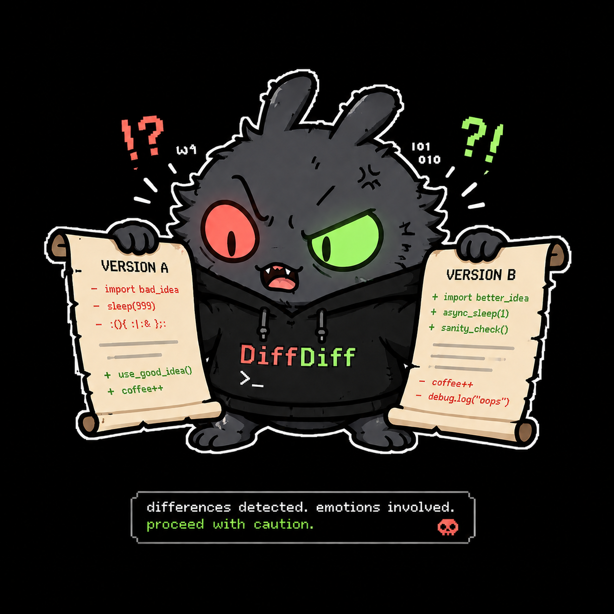

<p align="center">
  <a href="https://go.dev/"></a>
  <a href="LICENSE"></a>
  <a href="https://github.com/omarluq/diffdiff/actions/workflows/ci.yml"></a>
</p>

A fast desktop viewer for your Git working-tree diff, built with [Fyne](https://fyne.io).

## Features

- **Working-tree diff** — every staged, unstaged, and untracked change (`git diff HEAD`); gitignored files are excluded.
- **Syntax highlighting** — via [Chroma](https://github.com/alecthomas/chroma), with 20 built-in themes.
- **File panel** — fuzzy filter, Material Icon Theme icons, and a flat-path or nested-tree view.
- **Diff layouts** — unified (stacked) or split (side-by-side), with intra-line emphasis.
- **Fonts** — a picker of bundled programming fonts.

## Run

```bash
mise install                   # pinned Go + Task toolchain
mise exec -- task run           # build ./bin/diffdiff and launch it in the current repo
```

`diffdiff [path]` opens the repository at `path` (default: the current directory); switch repositories anytime from the folder button in the toolbar.

## License

MIT
