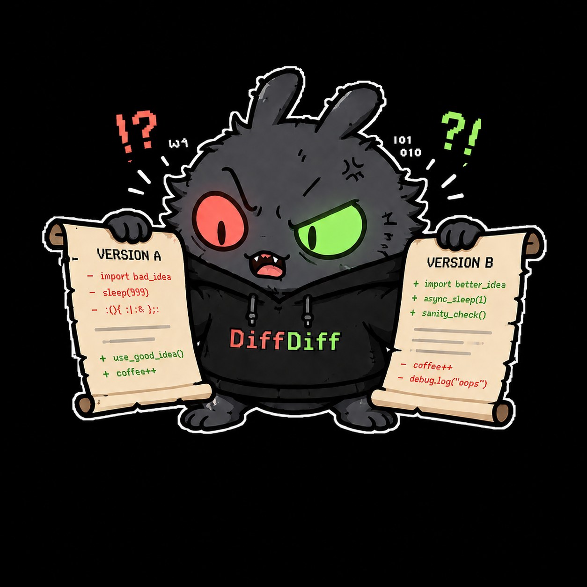

<p align="center">
  
</p>
<p align="center">
  <a href="https://go.dev/"></a>
  <a href="LICENSE"></a>
  <a href="https://github.com/omarluq/diffdiff/actions/workflows/ci.yml"></a>

  <p align="center"> A fast, themeable desktop app for browsing your Git working-tree diff </p>

</p>

## Run

```bash
mise install                   # pinned Go + Task toolchain
mise exec -- task run           # build ./bin/diffdiff and launch it in the current repo
```

`diffdiff [path]` opens the repository at `path` (default: the current directory); switch repositories anytime from the folder button in the toolbar.

## License

MIT
